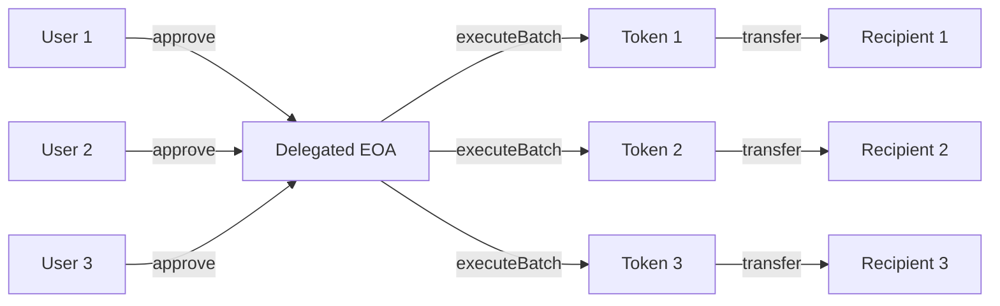

# EIP-7702 Batch Transfer Tutorial

This tutorial walks through setting up an EOA with EIP-7702 delegation and executing batch token transfers.

## Prerequisites

- Node.js v16+
- Foundry (for smart contract testing)
- A wallet with ETH on Base Sepolia or Base mainnet
- Basic understanding of Ethereum and ERC-20 tokens

## Overview

EIP-7702 allows EOAs to delegate code execution to a smart contract without deploying a new contract or changing addresses. This enables features like batch transfers while keeping the simplicity of an EOA.

## Step 1: Environment Setup

1. Clone the example:
```bash
git clone <your-repo>
cd hello-world-eip7702
```

2. Install dependencies:
```bash
npm install
forge install
```

3. Configure environment:
```bash
cp .env.example .env
```

Edit `.env`:
```env
PRIVATE_KEY=your_private_key_here
RPC_URL=https://sepolia.base.org
CHAIN_ID=84532
SMART_ACCOUNT_IMPLEMENTATION=0x000100abaad02f1cfc8bbe32bd5a564817339e72
```

## Step 2: Understanding EIP-7702 Delegation

When you delegate an EOA using EIP-7702:

1. Your EOA's code is set to: `0xef0100` + implementation address
2. When someone calls your EOA, the EVM executes the implementation's code
3. The EOA maintains its address and private key

## Step 3: Setting Up Delegation

Run the delegation setup:
```bash
npm run setup-delegation
```

This script:
1. Checks if your EOA is already delegated
2. Creates an EIP-7702 authorization
3. Sends the delegation transaction
4. Verifies the delegation was successful

After delegation, your EOA code will be:
```
0xef0100000100abaad02f1cfc8bbe32bd5a564817339e72
```

## Step 4: Understanding the Batch Transfer Flow

The batch transfer process:



## Step 5: Getting User Approvals

Users must approve your delegated EOA to transfer their tokens:

```javascript
// User approves the delegated EOA
await tokenContract.approve(delegatedEOA, amount);
```

In production, you would:
1. Connect to user wallets (MetaMask, WalletConnect)
2. Request specific approval amounts
3. Store approval status in your backend

## Step 6: Executing Batch Transfers

Once users have approved, execute batch transfers:

```bash
npm run batch-transfer
```

The batch transfer encodes multiple `transferFrom` calls into a single transaction:

```javascript
const calls = [
    {
        target: tokenAddress1,
        value: 0,
        data: encodeTransferFrom(from1, to1, amount1)
    },
    {
        target: tokenAddress2,
        value: 0,
        data: encodeTransferFrom(from2, to2, amount2)
    },
    // ... more transfers
];
```

## Step 7: Testing

Run the Foundry tests:
```bash
forge test
```

The tests demonstrate:
- Setting up delegation (simulated)
- Getting user approvals
- Executing batch transfers
- Handling edge cases

## Example: Complete Flow

Here's a complete example flow:

```javascript
// 1. Setup delegation (one time)
const authorization = {
    chainId: 84532n,
    address: IMPLEMENTATION,
    nonce: await provider.getTransactionCount(wallet.address)
};

// 2. Users approve (each user)
await token.approve(delegatedEOA, amount);

// 3. Execute batch (anytime after approvals)
const batchData = encodeBatchExecution(transfers);
await wallet.sendTransaction({
    to: wallet.address,
    data: batchData
});
```

## Gas Savings

Batch transfers provide significant gas savings:

| Method | Gas per Transfer | 100 Transfers Total |
|--------|-----------------|-------------------|
| Individual | ~65,000 | ~6,500,000 |
| Batched | ~35,000 | ~3,500,000 |
| **Savings** | **~46%** | **~3,000,000** |

## Security Considerations

1. **Implementation Trust**: Only delegate to verified implementations
2. **Approval Management**: Users should approve only necessary amounts
3. **Revocation**: Provide ways for users to revoke approvals
4. **Monitoring**: Track all batch operations for transparency

## Troubleshooting

### "EOA is not delegated"
Run `npm run setup-delegation` first

### "Insufficient allowance"
Users need to approve the delegated EOA first

### "EIP-7702 not supported"
Ensure you're using Base Sepolia or Base mainnet with a compatible RPC

### Transaction fails
Check:
- Gas limit is sufficient for all transfers
- All users have approved the amounts
- Token contracts are correct

## Next Steps

1. **Production Setup**: 
   - Implement proper key management
   - Add monitoring and logging
   - Create user-friendly UI

2. **Advanced Features**:
   - Add support for ETH transfers
   - Implement conditional transfers
   - Add multicall for other operations

3. **Integration**:
   - Connect with wallets (WalletConnect, MetaMask)
   - Build approval management system
   - Create batch builder UI

## Resources

- [EIP-7702 Specification](https://eips.ethereum.org/EIPS/eip-7702)
- [Coinbase Smart Account Docs](https://docs.cdp.coinbase.com/paymaster/need-to-knows/eip-7702-faqs)
- [Base Network](https://base.org)

## Support

For issues or questions:
- Check the [FAQ](./FAQ.md)
- Open an issue on GitHub
- Join the Base Discord